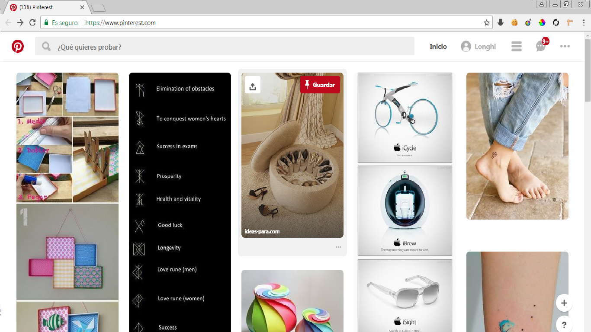
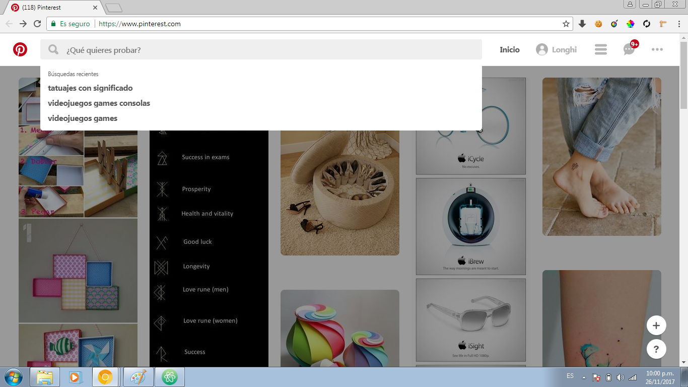
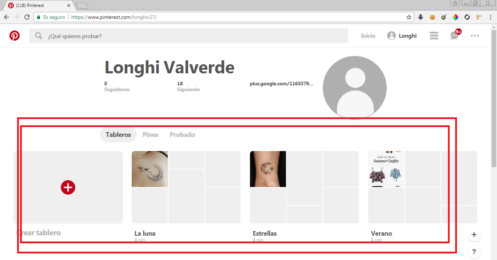
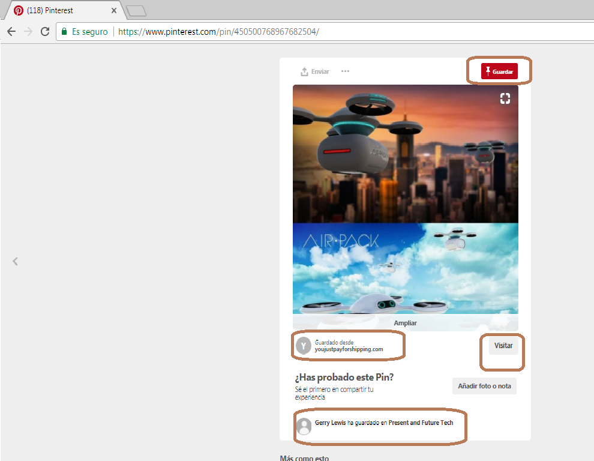

# Partes de UX Y UI
#### PINTEREST:
### UI
1. El icono de la pagina
2. Los botones para linkear y buscar
3. El color de fondo y colores de otras partes de la pagina
4. Los menus desplegables
5. Movimiento del maouse y que salga el icono de la lupa cuando pasa por una imagen
6. El hover de los botones
7. Bordeado de las imagenes
### UX
 **1. Muestra varias imagenes como sugerencias a mi interes.**

**2. Me da un buscador y ne aparece akgunas sugerecias de lo que ya he buscado anteriormente.**

**3. Al entrar al usuario nos da imagenes que ya guardamos anteriormente.**

**4. Al hacer click en la imagen nos da la pagina a donde visitarlo y si deseamos guardar y quien mas ha guardado este link.**

